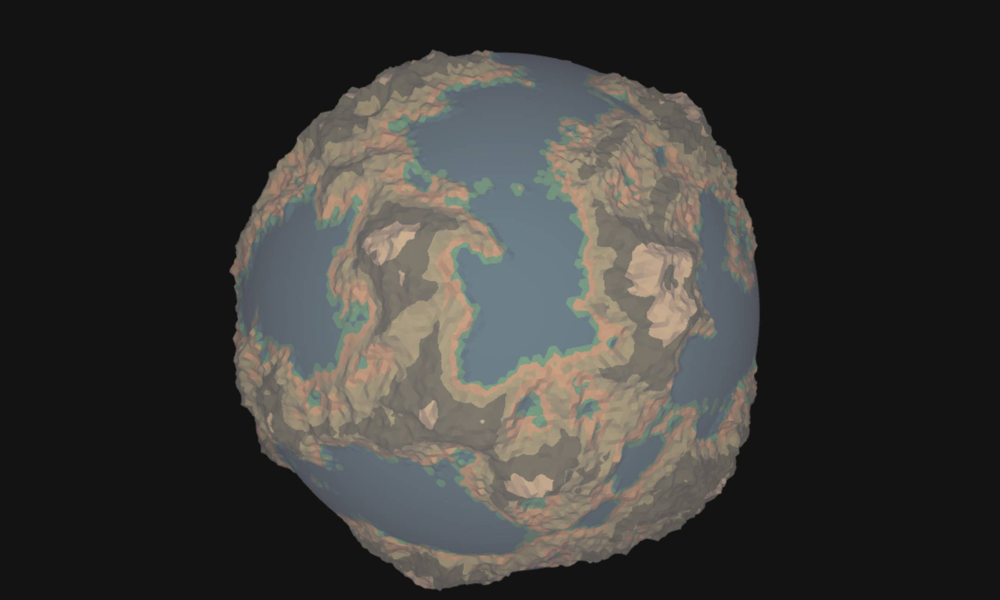

<br />
<p align="center">
    <a href="">
        
    </a>

  <h1 align="center">gl-Noise</h1>
  
  <p align="center">
    A collection of GLSL noise functions for use with WebGL with an easy to use API.
    <br />
    <a href="https://farazzshaikh.github.io/glNoise/examples/index.html">View Demo</a>
    ·
    <a href="https://github.com/FarazzShaikh/glNoise/issues/new">Report Bug</a>
    ·
    <a href="https://farazzshaikh.github.io/glNoise/">API Docs</a>
  </p>
  <p align="center">
    <a href="https://www.npmjs.com/package/gl-noise"></a>
  </p>

  <p align="center">
    My work is for and funded by the community. If you used this or found this helpful consider supporting me.
  </p>

  <p align="center">
    <a href="https://farazzshaikh.github.io/glNoise/examples/support.html?via=ETH"></a>
    <a href="https://farazzshaikh.github.io/glNoise/examples/support.html?via=BTC"></a>
    <a href="https://farazzshaikh.github.io/glNoise/examples/support.html?via=DOGE"></a>
     <a href="https://paypal.me/farazzshaikh"></a>
  </p>
</p>


<details open>
  <summary>Table of Contents</summary>
  <ol>
    <li>
      <a href="#why-this">Why This?</a>
      </li>
      <li>
      <a href="#installation">Installation</a>
      </li>
      <li>
      <a href="#importing">Importing</a>
      </li>
       <li>
        <a href="#usage---javascript">Usage - JavaScript</a>
        <ul>
            <li><a href="#shader-chunks">Shader Chunks</a></li>
            <ul>
                <li><a href="#loadshadersraw">`loadShadersRaw`</a></li>
                <li><a href="#loadshaders">`loadShaders`</a></li>
                <li><a href="#loadshaderscsm">`loadShadersCSM`</a></li>
            </ul>
            <li><a href="#loaders">Loaders</a></li>
        </ul>
        </li>
      <li>
      <a href="#usage---glsl">Usage - GLSL</a>
      </li>
      <li>
      <a href="#credits">Credits</a>
      </li>
  </ol>
</details>

<br />

  <p align="center">
    </img>
     Low-poly planet generated using gl-Noise.
  </p>

<br />

## Why this?

There already exist excellent resources that compile a list of algorithms such as:
- [This Gist by Patricio Gonzalez Vivo](https://gist.github.com/patriciogonzalezvivo/670c22f3966e662d2f83)
- [This library by Ashima Arts](https://github.com/ashima/webgl-noise)
- [The Book of shaders of course](https://thebookofshaders.com/)

And many more. But they all either require another library like Glslify or require you to manually copy and paste them into your shader code.

So this library addresses both those issues. It does not require any third-party libraries and you can include and use these noise functions without even having to give it a second thought.

**Examples can be found in the `examples` directory.**

## Installation

```bash
$ npm i gl-noise
```
or
```bash
$ yarn add gl-noise
```

gl-Noise uses ES Modules, in the browser, simply declare your script as a module and then import it as you would in node.


```html
<script src="./main.js" type="module"></script>
<!--                         👆 This lets you use ES Module import syntax-->
```

## Importing

If you are on Node, you can import like so:
```js
import {
    // Loaders
    loadShaders,
    loadShadersRaw,
    loadShadersCSM,

    // Individual Shader Chunks
    Perlin,
    Simplex,
    Voronoi
} from "gl-noise"
```

**In browsers (Chrome Desktop only)**, if you'd like to use NPM and the Node syntax then you will have to add an `import-map` to your HTML. Simply place this code above your script.
```html
<script type="importmap">
{
    "imports": {
        "gl-noise": "/node_modules/gl-noise/build/glNoise.m.js",
    }
}
</script>
```

Then you can use Node-like imports:
```js
import {} from "gl-noise"
//                 👆 Notice, we don't have to specify the
//                    whole path (node_modules/.../...).
//                    If you don't use the import-map, then
//                    you will have to specify the path.
```

**In browsers**, You can also download `build/glNoise.m.js` and import it from wherever you want to save it as an ES Module. Alternatively, you can also download the IIFE type module from `build/glNoise.js` and include it in a script tag like people have been doing forever.

```html
<script src="lib/glNoise.js"></script>
<script src="./main.js"></script>
```

## Usage - JavaScript


### Shader Chunks

A Shader Chunk is a self-contained piece of shader code that can be injected and used in a shader program. gl-Noise provides various Shader Chunks. 

```js
import {
    Perlin,     // 👈 2D Perlin Noise
    Simplex,    // 👈 2D Simplex Noise
    Voronoi     // 👈 2D Voronoi Noise
} from "gl-noise"
```

**It also has a bunch of utility functions. See the [API Reference](https://farazzshaikh.github.io/glNoise/module-Common.html) for more info on all available functions.**

You can load these chunks along with shaders as you will see in the next section.

### Loaders

gl-Noise provides three types of loaders. You can read about them in the [API Reference](https://farazzshaikh.github.io/glNoise/global.html#loadShaders) but here is a summary.

#### `loadShadersRaw`

This function loads shaders without any processing. Like loading a text file.

```js
// Paths must be an array of strings
const paths = [
    "path/to/s1.glsl",
    "path/to/s2.glsl",
    "path/to/s3.glsl",
]


loadShadersRaw(paths).then(([s1, s2, s3]) => {
    // whatever
})
    
```

#### `loadShaders`
This function loads shaders and appends the provided chunks to them. The chunks can be imported from gl-Noise and are just strings that will be appended to each shader.

```js
import { Perlin, Simplex, Common } from "gl-noise"
import { CustomChunk } from "custom/path.glsl"

// Paths must be an array of strings
const paths = [
    "path/to/s1.glsl",
    "path/to/s2.glsl",
    "path/to/s3.glsl",
];

// Chunks are optional. If undefined or NULL, 
// all available inbuilt chunks will be appened
const chunks = [
    [Perlin, Simplex],      // 👈 Chunks to include with s1
    [CustomChunk],          // 👈 Chunks to include with s2
    null                    // 👈 Chunks to include with s3
]

// Headers are optional. If undefined or NULL, 
// only the "Common" shader chunk will be appened
const headers = [
    `precision highp float;`,   👈 Header to include with s1
    `
    precision highp float;      👈 Header to include with s2
    ${Common}
    `,
    null,                       👈 Header to include with s3
    
]

loadShaders(paths, chunks, headers).then(([s1, s2, s3]) => {
    // whatever
})

```

#### `loadShadersCSM`

**This function is to be used with [THREE-CustomShaderMaterial](https://github.com/FarazzShaikh/THREE-CustomShaderMaterial)**. It appends shader chunks to the `header` section of the provided inputs.

```js

const CSMpaths = {
  defines: "./shaders/defines.glsl",
  header: "./shaders/header.glsl",
  main: "./shaders/main.glsl",
};

const CSMchunks = [Perlin, Simplex]

// Loads shaders with CSM Friendly format
loadShadersCSM(CSMpaths, CSMchunks).then(({defines, header, main}) => {
    // whatever
})


```

## Usage - GLSL

Once the chunks are imported properly, using gl-Noise Within GLSL is a breeze. All you have to do is call the function you want with the right arguments.

```glsl
float p = gln_perlin(uv);
float n = gln_normalize(p);
```

**See the full list of available functions in the [API Reference](https://farazzshaikh.github.io/glNoise/module-Common.html).**

## Development

The concept is pretty simple. You can fork it and write your GLSL functions in a file with the `.glsl` extension in the `src` directory. **The function must be shader independent so no use of `gl_FragCoord` or any shader-specific variables.** 

You can document your code using [JSDoc](https://jsdoc.app/about-getting-started.html) style comment blocks. The documentation is auto-generated so you **MUST** include a `@name` with the name of your function. See the preexisting functions for reference. This is because 

Include your file in index.ts by importing it and exporting it like all the preexisting files. Make sure to include your new file in the `_all` array.

That's it. You can see if it builds by running

```bash
npm run build
```

It's ideal if you'd include your new noise function as an example but not required.


## Credits

I have not come up with these noise functions. Here's attribution to the creators of them.

| Noise | Maker | Reference | License |
|-------|-------|-----------|---------|
| Perlin Noise | Hugh Kennedy | [GitHub](https://github.com/hughsk/glsl-noise/blob/master/periodic/2d.glsl) | MIT |
| Simplex Noise | Ian McEwan | [GitHub](https://github.com/ashima/webgl-noise/blob/master/src/noise3D.glsl) | MIT |
| Worley Noise | Max Bittker | [GitHub](https://github.com/MaxBittker/glsl-voronoi-noise) | MIT |

Every other function is by yours truly.

**Note:** Simplex Noise is patented. The one used here is just an approximation.

**If you see your function being used in this library, please open an issue so I can credit you or remove the function ASAP.**
